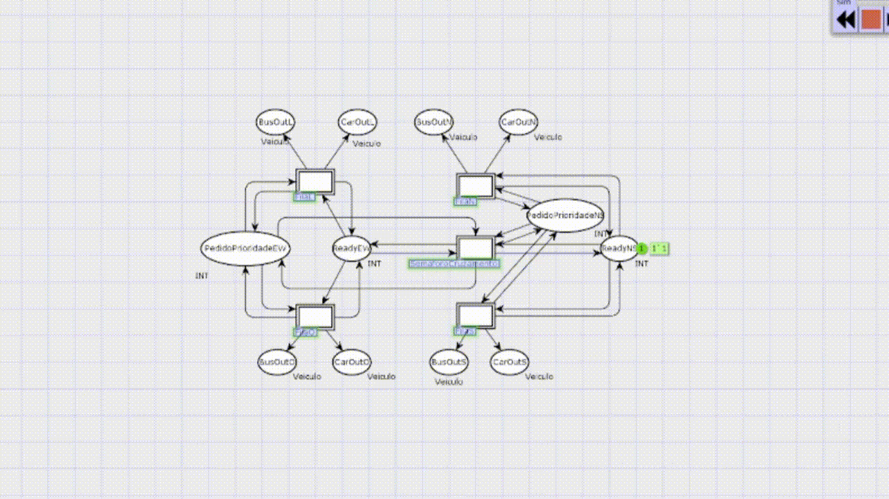

# 📦 Traffic Control System with Hierarchichal Coloured Petri Nets

  
  

  

# 🚦 Traffic Control System with Priority for Public Transport using HCPNs  

This project models an **urban intersection with four directions** using **Hierarchical Colored Petri Nets (HCPNs)** in the **CPN Tools** environment. The goal is to represent traffic flow, traffic light control, and priority mechanisms for public transport vehicles, while simulating constraints such as arrival distributions, cycle times, and sensor-based priority activation.  

## 🔧 About the System  

The traffic intersection consists of:  
- **Four directions**: North, South, East, and West.  
- **Traffic lights** for cars, buses, and pedestrians.  
- **Dedicated lane for public transport** (e.g., buses), equipped with a **priority detection sensor**.  
- **Vehicle queues** modeled with probabilistic arrivals (e.g., Poisson distribution).  

## 🎯 Modeling Objective  

The modeling aims to:  
- Control the flow of vehicles and pedestrians through the intersection.  
- Implement **priority logic** for buses, extending the green light when a bus is detected.  
- Simulate **realistic timing** for lights (green, yellow, red).  
- Analyze system behavior under different traffic scenarios.  

## 🧠 Modeling Approach  

The modeling uses:  
- **Hierarchical Colored Petri Nets (HCPNs)**: to modularize and scale the system.  
- **Colored tokens**: represent different types of road users (cars, buses, pedestrians).  
- **Transition guards and timed transitions**: to enforce conditions and simulate time delays.  
- **Hierarchical pages**: separate modules for traffic lights, queues, and priority detection.  

## 🧩 System Components  

### ✅ Vehicles  
- `car`: common vehicle  
- `bus`: public transport vehicle (activates priority)  
- `pedestrian`: modeled as a separate token type  

### ✅ Traffic Lights  
- States: **Green (30s)**, **Yellow (5s)**, **Red (adjustable)**  
- **Priority extension**: +15s green if a bus is detected.  

### ✅ Queues  
- Each direction maintains a queue of arriving vehicles.  
- Arrivals are modeled probabilistically (e.g., Poisson).  

### ✅ Priority Detection  
- Sensor detects bus arrival in the dedicated lane.  
- Overrides or extends the green phase for that direction.  

## 📌 System Behavior  

1. **Vehicle and Pedestrian Arrival**  
   - Vehicles and pedestrians arrive at the intersection according to probabilistic distributions.  

2. **Traffic Light Cycle**  
   - Normal operation follows a **30s green, 5s yellow, red** pattern.  

3. **Priority Handling**  
   - When a bus is detected, the green phase is extended by 15s or interrupts the cycle to prioritize it.  

4. **Movement**  
   - Vehicles and pedestrians cross when their respective lights are green.  

## 🗂️ Hierarchical Structure  

- **Top Page (Intersection Overview)**: connects all subsystems.  
- **Traffic Light Control Module**: models state changes (green, yellow, red).  
- **Queue Management Module**: handles arrivals and departures of cars, buses, and pedestrians.  
- **Priority Detection Module**: activates priority when a bus is present.   

## Project Video  

For more details, check out the [explanation video](https://drive.google.com/file/d/1Fq92dcAyffwg1yq9Lrnh6UqAtt3kXBVu/view?usp=sharing).  

## 👨‍🔬 Author  

This project was developed by **Mateus Pincho** as part of the evaluation for the Discrete Event Systems course, taught by Prof. Dr. Kyller Costa Gorgônio.  

---
